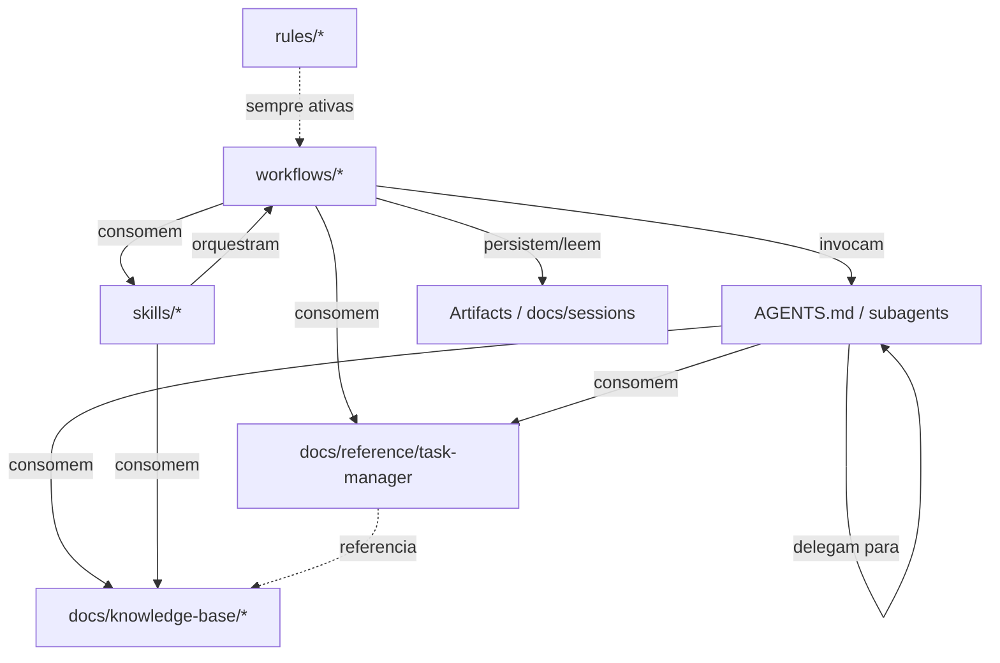

# Meta-spec — Arquitetura do Sistema Onion

## Propósito

Define a estrutura de diretórios obrigatória, o princípio de **framework instalável** e as dependências permitidas entre categorias. Esta spec normatiza o que constitui o "esqueleto" do Sistema Onion como artefato reutilizável em projetos-alvo.

Aplica-se ao **Sistema Onion**, não ao projeto-alvo onde o Onion é instalado.

Referências relacionadas:

- [agents.md](./agents.md), [commands.md](./commands.md)
- [code-standards.md](./code-standards.md), [integrations.md](./integrations.md)

---

## 1. Estrutura de diretórios obrigatória

### 1.1 Root do framework

```
.agents/                    # Operacional — artefatos consumidos pelo Antigravity (workspace)
docs/                       # Documentação consumida por humanos e IA
README.md                   # Identidade e ponto de entrada
CONTRIBUTING.md             # Guidelines para evolução
.env, .env.example          # Configuração de providers e integrações
```

> Config global do Antigravity (não versionada) vive em `~/.gemini/` —
> `mcp_config.json`, `GEMINI.md`, skills compartilhadas, etc. (ver [integrations.md](./integrations.md)).

### 1.2 Estrutura de `.agents/`

```
.agents/
├── AGENTS.md               # Personas / "equipe de IA" (leads das 3 dimensões + orquestrador)
│
├── rules/                  # System instructions always-on
│   ├── onion-identity.md
│   ├── language-standards.md
│   ├── task-manager-routing.md
│   └── onion-conventions.md
│
├── workflows/              # Saved prompts /-invocáveis (flat + prefixo de categoria)
│   ├── engineer-*.md       # Workflow faseado de implementação
│   ├── product-*.md        # Workflow faseado de descoberta e spec
│   ├── git-*.md            # GitFlow (feature/hotfix/release achatados)
│   ├── docs-*.md           # Geração e validação de documentação
│   ├── meta-*.md           # Criação de artefatos do Onion
│   ├── validate-*.md · test-*.md · quick-*.md · development-*.md
│   ├── onion.md            # Ponto de entrada inteligente
│   └── warm-up.md          # Preparação geral de contexto
│
├── skills/                 # Conhecimento contextual (on-demand)
│   ├── onion/SKILL.md      # Orquestrador master
│   └── onion-validation/SKILL.md
│
├── hooks.json              # Hooks de ciclo de vida (Pre/PostToolUse, Pre/PostInvocation)
└── mcp_config.example.json # Template MCP → ~/.gemini/config/mcp_config.json
```

> Estado persistente de workflows faseados usa os **Artifacts** do Antigravity
> (task lists, implementation plans, walkthroughs); contexto versionado
> complementar pode viver em `docs/sessions/<feature>/`.

### 1.3 Estrutura de `docs/`

```
docs/
├── INDEX.md                # Hub de navegação
│
├── meta-specs/             # L0 — constituição do framework (esta spec é uma delas)
│   ├── index.md · agents.md · commands.md · architecture.md
│   ├── code-standards.md · integrations.md
│
├── analysis/               # Análises críticas datadas (snapshots) + ADRs
├── plans/                  # Planos de execução
├── onion/                  # Documentação operacional (guias, referências, releases)
├── reference/              # Task Manager Abstraction + utilitários (consumidos por workflows)
│   └── task-manager/       # interface, types, detector, factory, adapters/
│
├── knowledge-base/         # KBs estruturadas para consumo por IA
│   ├── concepts/ · frameworks/ · tools/ · platforms/ · providers/
│
├── sdaal/                  # KB ativa sobre o padrão SDAAL
├── sessions/               # (opcional) contexto versionado de features
│
├── business-context/       # Template vazio — populado no projeto-alvo
├── technical-context/      # Template vazio — populado no projeto-alvo
└── compliance-context/     # Template vazio — populado no projeto-alvo (quando aplicável)
```

---

## 2. Separação `.agents/` vs `docs/`

| Aspecto | `.agents/` | `docs/` |
|---|---|---|
| Natureza | Operacional | Documentação |
| Consumido por | Google Antigravity (em runtime) | Humanos + IA (em leitura) |
| Formato | Markdown estruturado para execução | Markdown para consumo informacional |
| Versionamento | Junto com PRs que alteram comportamento | Junto com PRs que mudam doutrina ou descobertas |
| Acesso pelo usuário final | Indireto via invocação (`/<workflow>`, persona) | Direto via leitura de arquivos |

**Regra**: artefato invocável vive em `.agents/`; descrição/explicação/análise vive em `docs/`.

---

## 3. Princípio de framework instalável

O Sistema Onion deve ser **instalável em qualquer projeto** (novo, legado ou regulado) **copiando ou clonando `.agents/` e `docs/`** sem necessidade de adaptação de paths absolutos.

### 3.1 Premissas que o framework PODE assumir sobre o projeto-alvo

- Tem `.agents/` no root do projeto (estrutura de workspace do Antigravity)
- Pode ter `.env` no root (criado a partir de `.env.example` via `/meta-setup-integration`)
- Pode (mas não precisa) ter `docs/` para os contextos spec-as-code
- O usuário tem o Antigravity instalado, com config global em `~/.gemini/`

### 3.2 Premissas que o framework NÃO PODE assumir

- Path absoluto específico (ex: `/home/<user>/`)
- Existência de monorepo, NX, ou estrutura específica
- Linguagem de programação específica (Node, Python, Go)
- Provider de Task Manager pré-configurado
- Existência de `git` inicializado

### 3.3 Implicações

- Workflows e personas devem usar **paths relativos** ou variáveis de ambiente
- Configuração específica do projeto-alvo vai em `.env` (não nos workflows/personas)
- Detecção de stack/linguagem deve ser dinâmica (`/docs-reverse-consolidate`)

---

## 4. Dependências permitidas entre categorias

### 4.1 Diagrama de dependências



### 4.2 Regras de dependência

| De → Para | Permitido | Notas |
|---|---|---|
| `workflows/*` → personas | Sim | Padrão de delegação |
| `workflows/*` → `skills/*` | Sim | Quando precisa de conhecimento contextual |
| `workflows/*` → `docs/reference/*` | Sim | Abstrações reutilizáveis (Task Manager) |
| `workflows/*` → Artifacts/`docs/sessions` | Sim | Workflows faseados persistem estado |
| personas → personas | Sim | Delegação entre especialistas |
| personas → `docs/knowledge-base/*` | Sim | KBs como referência |
| personas → `workflows/*` | **Não** | Persona não invoca workflow diretamente — sugere ao usuário |
| `skills/*` → `workflows/*`, personas, `docs/*` | Sim | Skills orquestram/contextualizam |
| `docs/reference/*` → personas, `workflows/*` | **Não** | Abstrações devem ser puras |
| `compliance` → `engineer` (direto) | **Não** | Coordenação via `meta-*` ou `/docs-build-compliance-docs` |

### 4.3 Acoplamento entre dimensões

As três dimensões peer (produto, engenharia, compliance) **não devem ter dependências cruzadas diretas** em nível de workflow. Coordenação acontece via:

- **Artifacts** / `docs/sessions/` (estado compartilhado)
- **Workflows `meta-*`**
- **Skill orquestradora** (`onion`)
- **Documentação consolidada** em `docs/`

---

## 5. Plataforma alvo

**Sistema Onion roda exclusivamente no Google Antigravity.**

Implicações:

- A camada operacional vive em `.agents/` (workspace) + `~/.gemini/` (config global do usuário)
- Não há CLI standalone próprio do Onion (apenas a Antigravity CLI/IDE como runtime)
- Não há produto npm distribuído
- Mudanças na plataforma Antigravity (estrutura de `.agents/`, formato de skills/workflows/hooks, MCP) podem exigir atualização do framework
- Migração histórica: o Onion rodava em Claude Code (`.claude/`) até 2026-06; ver [ADR-001](../analysis/onion-antigravity-migration-adr-2026-06.md)

---

## 6. Estrutura de release e versionamento

### 6.1 Versionamento

- Versão do framework: implícita no estado do branch `main` (não há semver formal)
- Versão de meta-specs: campo `version` no frontmatter, semver simples (`2.0.0`)
- Releases significativas: registradas em `docs/onion/RELEASE-NOTES-*.md` quando aplicável

### 6.2 Estado de workflows faseados

- Estado runtime usa Artifacts do Antigravity (efêmeros, revisáveis no Agent Manager)
- Contexto versionado opcional em `docs/sessions/<feature>/`
- `.gitignore` deve excluir `docs/sessions/` em projetos-alvo se o estado for individual

---

## 7. Proibições explícitas

- **Proibido** criar diretório de primeiro nível fora dos listados em Seções 1.2 e 1.3 sem PR específico para esta meta-spec
- **Proibido** reintroduzir `.claude/` ou `CLAUDE.md` (plataforma migrada para Antigravity em 2026-06)
- **Proibido** introduzir `.onion/` ou estrutura agnóstica alternativa (abandonado em 2026-05-18)
- **Proibido** criar `packages/` ou diretório de pacote distribuível (abandonado em 2026-05-18)
- **Proibido** persona invocar workflow fora da relação permitida (ver Seção 4.2)
- **Proibido** depender de path absoluto

---

## 8. Versionamento e mudanças

Mudanças nesta spec exigem:

1. PR específico para `docs/meta-specs/architecture.md`
2. Atualização do campo `version`
3. Avaliação de impacto em workflows/personas existentes
4. Aprovação por `@metaspec-gate-keeper`
