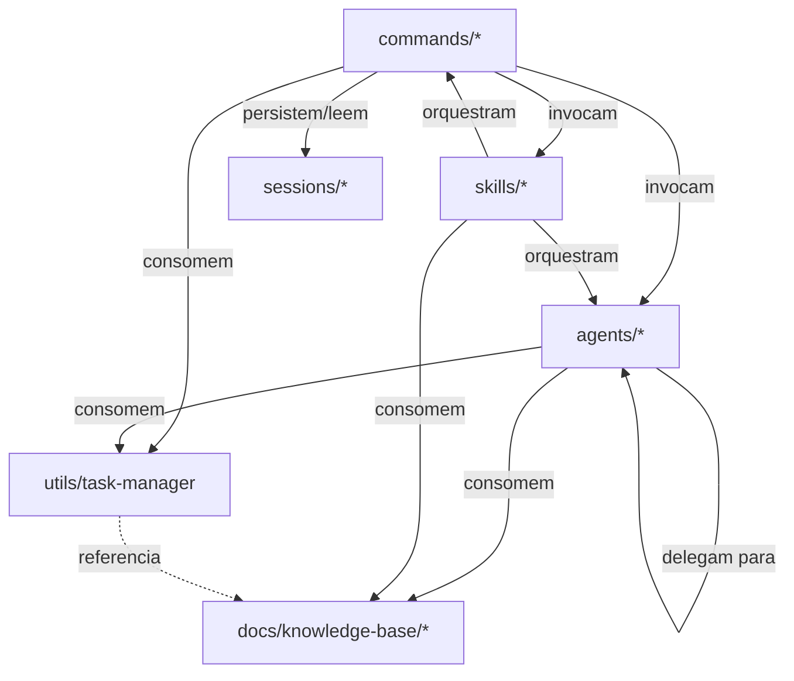

# Meta-spec — Arquitetura do Sistema Onion

## Propósito

Define a estrutura de diretórios obrigatória, o princípio de **framework instalável** e as dependências permitidas entre categorias. Esta spec normatiza o que constitui o "esqueleto" do Sistema Onion como artefato reutilizável em projetos-alvo.

Aplica-se ao **Sistema Onion**, não ao projeto-alvo onde o Onion é instalado.

Referências relacionadas:

- [agents.md](./agents.md), [commands.md](./commands.md)
- [code-standards.md](./code-standards.md), [integrations.md](./integrations.md)

---

## 1. Estrutura de diretórios obrigatória

### 1.1 Root do framework

```
.claude/                    # Operacional — artefatos invocáveis pelo Claude Code
docs/                       # Documentação consumida por humanos e IA
README.md                   # Identidade e ponto de entrada
CLAUDE.md                   # Regras de operação para Claude Code
CONTRIBUTING.md             # Guidelines para evolução
.env, .env.example          # Configuração de providers e integrações
```

### 1.2 Estrutura de `.claude/`

```
.claude/
├── agents/                 # Agentes especializados
│   ├── compliance/         # 5 agentes — frameworks regulatórios
│   ├── deployment/         # 1 agente — containerização
│   ├── development/        # ~20 agentes — especialistas técnicos
│   ├── git/                # 4 agentes — review pré-PR
│   ├── meta/               # 5 agentes — orquestração e criação
│   ├── product/            # 8 agentes — discovery e spec
│   ├── research/           # 1 agente — pesquisa
│   ├── review/             # 2 agentes — code review
│   └── testing/            # 3 agentes — testes
│
├── commands/               # Comandos invocáveis
│   ├── common/             # Templates e prompts compartilhados
│   ├── development/        # Comandos de desenvolvimento
│   ├── docs/               # Geração e validação de documentação
│   ├── engineer/           # Workflow faseado de implementação
│   ├── git/                # GitFlow (feature/, hotfix/, release/)
│   ├── global/             # Comandos transversais
│   ├── meta/               # Criação de artefatos do Onion
│   ├── product/            # Workflow faseado de descoberta e spec
│   ├── quick/              # Análises pontuais
│   ├── test/               # Estratégias de teste
│   ├── validate/           # Validação (test-strategy/, qa-points/, collab/)
│   ├── onion.md            # Ponto de entrada inteligente
│   └── warm-up.md          # Preparação geral de contexto
│
├── skills/                 # Skills (cérebro)
│   └── onion/              # Orquestrador master
│
├── sessions/               # Estado persistente de workflows faseados
│   └── <feature>/          # Por feature em desenvolvimento
│
├── utils/                  # Abstrações e utilitários
│   └── task-manager/       # Task Manager Abstraction (factory, interface, types, detector, adapters/)
│
├── rules/                  # Regras complementares (opcional)
├── docs/                   # Documentação interna do .claude/ (opcional)
└── validation/             # Scripts de validação (opcional)
```

### 1.3 Estrutura de `docs/`

```
docs/
├── INDEX.md                # Hub de navegação
│
├── meta-specs/             # L0 — constituição do framework (esta spec é uma delas)
│   ├── index.md
│   ├── agents.md
│   ├── commands.md
│   ├── architecture.md
│   ├── code-standards.md
│   └── integrations.md
│
├── analysis/               # Análises críticas datadas (snapshots)
├── plans/                  # Planos de execução
│
├── onion/                  # Documentação operacional (guias, referências, releases)
│
├── knowledge-base/         # KBs estruturadas para consumo por IA
│   ├── concepts/
│   ├── frameworks/
│   ├── tools/
│   ├── platforms/
│   └── providers/
│
├── sdaal/                  # KB ativa sobre o padrão SDAAL
│
├── business-context/       # Template vazio — populado no projeto-alvo
├── technical-context/      # Template vazio — populado no projeto-alvo
└── compliance-context/     # Template vazio — populado no projeto-alvo (quando aplicável)
```

---

## 2. Separação `.claude/` vs `docs/`

| Aspecto | `.claude/` | `docs/` |
|---|---|---|
| Natureza | Operacional | Documentação |
| Consumido por | Claude Code (em runtime) | Humanos + IA (em leitura) |
| Formato | Markdown estruturado para execução | Markdown para consumo informacional |
| Versionamento | Junto com PRs que alteram comportamento | Junto com PRs que mudam doutrina ou descobertas |
| Acesso pelo usuário final | Indireto via invocação (`/<comando>`, `@<agente>`) | Direto via leitura de arquivos |

**Regra**: artefato invocável vive em `.claude/`; descrição/explicação/análise vive em `docs/`.

---

## 3. Princípio de framework instalável

O Sistema Onion deve ser **instalável em qualquer projeto** (novo, legado ou regulado) **copiando ou clonando `.claude/` e `docs/`** sem necessidade de adaptação de paths absolutos.

### 3.1 Premissas que o framework PODE assumir sobre o projeto-alvo

- Tem `.claude/` no root do projeto (estrutura padrão do Claude Code)
- Tem um arquivo `CLAUDE.md` no root que pode ser sobrescrito ou estendido
- Pode ter `.env` no root (criado a partir de `.env.example` via `/meta:setup-integration`)
- Pode (mas não precisa) ter `docs/` para os contextos spec-as-code

### 3.2 Premissas que o framework NÃO PODE assumir

- Path absoluto específico (ex: `/home/<user>/`)
- Existência de monorepo, NX, ou estrutura específica
- Linguagem de programação específica (Node, Python, Go)
- Provider de Task Manager pré-configurado
- Existência de `git` inicializado

### 3.3 Implicações

- Comandos e agentes devem usar **paths relativos** ou variáveis de ambiente
- Configuração específica do projeto-alvo vai em `.env` (não em comandos/agentes)
- Detecção de stack/linguagem deve ser dinâmica (`/docs:reverse-consolidate`)

---

## 4. Dependências permitidas entre categorias

### 4.1 Diagrama de dependências



### 4.2 Regras de dependência

| De → Para | Permitido | Notas |
|---|---|---|
| `commands/*` → `agents/*` | Sim | Padrão de delegação |
| `commands/*` → `skills/*` | Sim | Quando precisa de orquestração |
| `commands/*` → `utils/*` | Sim | Abstrações reutilizáveis (Task Manager) |
| `commands/*` → `sessions/*` | Sim | Workflows faseados persistem estado |
| `agents/*` → `agents/*` | Sim | Delegação entre especialistas |
| `agents/*` → `docs/knowledge-base/*` | Sim | KBs como referência |
| `agents/*` → `utils/*` | Sim | Especialmente Task Manager |
| `agents/*` → `commands/*` | **Não** | Agente não invoca comando diretamente — sugere ao usuário |
| `skills/*` → `commands/*`, `agents/*`, `docs/*` | Sim | Skills são orquestradores |
| `utils/*` → `agents/*`, `commands/*` | **Não** | Abstrações devem ser puras |
| `compliance/` → `engineer/` (direto) | **Não** | Coordenação via `meta/` ou `docs/build-compliance-docs` |

### 4.3 Acoplamento entre dimensões

As três dimensões peer (produto, engenharia, compliance) **não devem ter dependências cruzadas diretas** em nível de comando. Coordenação acontece via:

- **Sessions** (estado compartilhado)
- **Meta-comandos** em `meta/`
- **Skills** orquestradoras (`skill: onion`)
- **Documentação consolidada** em `docs/`

---

## 5. Plataforma alvo

**Sistema Onion roda exclusivamente em Claude Code.**

Implicações:

- Não há suporte planejado para Cursor, Continue, Cline ou outras CLIs
- Não há CLI standalone (`onion init/add/migrate` foram abandonados em 2026-05-18)
- Não há produto npm distribuído
- Mudanças na plataforma Claude Code (estrutura de `.claude/`, formato de skills, novas tools) podem exigir atualização do framework

---

## 6. Estrutura de release e versionamento

### 6.1 Versionamento

- Versão do framework: implícita no estado do branch `main` (não há semver formal)
- Versão de meta-specs: campo `version` no frontmatter, semver simples (`1.0.0`)
- Releases significativas: registradas em `docs/onion/RELEASE-NOTES-*.md` quando aplicável

### 6.2 Sessões e estado

- `.claude/sessions/<feature>/` é estado runtime, não versionado por padrão
- `.gitignore` deve excluir `.claude/sessions/` em projetos-alvo se o estado for individual
- No repo do Onion (este repositório), `.claude/sessions/` pode ser preservado para teste/exemplo

---

## 7. Proibições explícitas

- **Proibido** criar diretório de primeiro nível fora dos listados em Seções 1.2 e 1.3 sem PR específico para esta meta-spec
- **Proibido** introduzir `.onion/` ou estrutura agnóstica alternativa (abandonado em 2026-05-18)
- **Proibido** criar `packages/` ou diretório de pacote distribuível (abandonado em 2026-05-18)
- **Proibido** comando invocar agente fora da relação permitida (ver Seção 4.2)
- **Proibido** depender de path absoluto

---

## 8. Versionamento e mudanças

Mudanças nesta spec exigem:

1. PR específico para `docs/meta-specs/architecture.md`
2. Atualização do campo `version`
3. Avaliação de impacto em comandos/agentes existentes
4. Aprovação por `@metaspec-gate-keeper`
